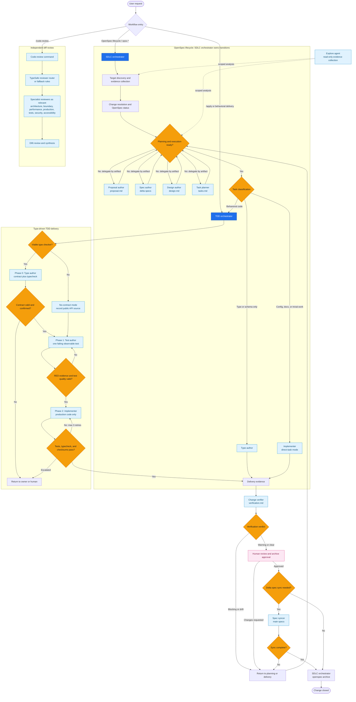

# OpenCode Software Factory Architecture

This harness uses a top-level OpenSpec lifecycle orchestrator. It selects the target workspace and change, owns lifecycle transitions, and delegates artifact work, delivery, review, and verification to scoped agents. The human remains the archive gate.

## Authority boundaries

- `sdlc-orchestrator` alone owns OpenSpec lifecycle commands, state transitions, task-completion status, and archive readiness.
- Planning authors edit only their assigned artifact. `spec-syncer` updates main specs only after orchestrator gating.
- `tdd-orchestrator` owns the type → RED → GREEN protocol. `type-author`, `test-author`, and `implementer` work in separated scopes; the orchestrator independently checks each phase.
- `change-verifier` writes `verification.md`, the canonical human review surface. It advises archive readiness but does not transition lifecycle state.
- Specialist reviewers and `explore` are evidence-gathering roles; they do not change the target worktree.
- A human must review current verification evidence and explicitly approve before `openspec archive` runs.
